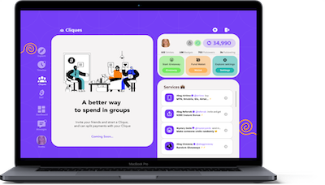

# 👋 Hi there, welcome to my page!

## 🙈 About Me

- 👀 I’m interested in developing sotware programs like web & mobile. I also love to design.
- 🌱 I’m currently learning react, nextjs, react native & flutter.
- 💞️ I’m looking to collaborate with designers, as well as web and mobile developers.
- 📫 How to reach me on Twitter: @viknedus

## 🌱 Designs

| Framer                                                                             | Figma                                                                                  |
| ---------------------------------------------------------------------------------- | -------------------------------------------------------------------------------------- |
|  |  |
| and more on Canva.                                                                 |

<!---
viknedus/viknedus is a ✨ special ✨ repository because its `README.md` (this file) appears on your GitHub profile.
You can click the Preview link to take a look at your changes.
--->
